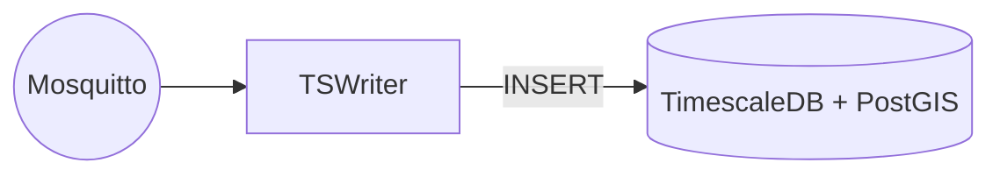

```mermaid
graph LR
  MQTT((Mosquitto)) --> TSWriter
  TSWriter -->|INSERT| PG[(TimescaleDB + PostGIS)]
```

The Timeseries Writer is available behind Traefik under the `/db` prefix.
Requests like `/db/metrics` are forwarded to `/metrics` inside the service.
