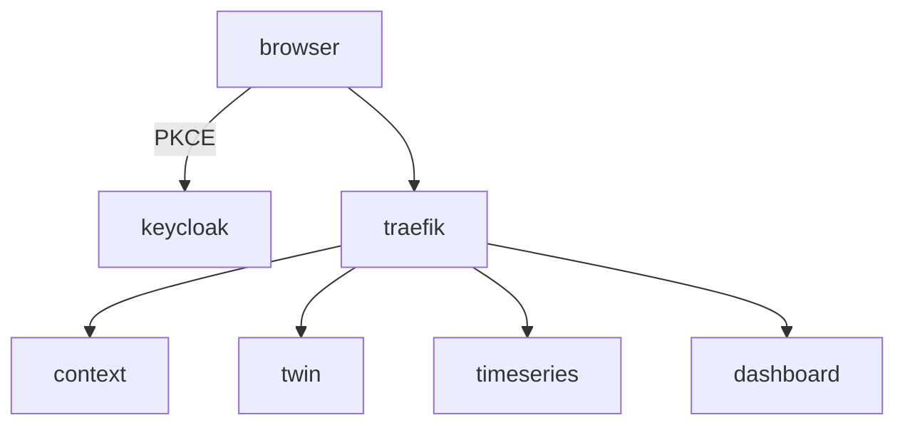

# Seguridad y autenticación

Este documento describe el flujo OIDC empleado en SmartPort. Keycloak expone el realm `smartport` con los clientes definidos para cada servicio. Los microservicios verifican los JWT firmados mediante RS256 y emitidos por `http://keycloak:8080`.

Los servicios usan tokens de cliente para comunicarse entre ellos a través de la cabecera `X-Auth-Token`.
